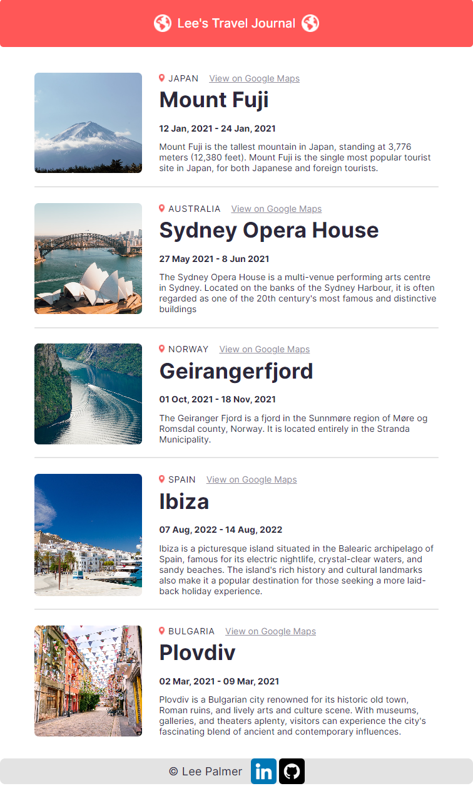

# React Travel Journal

This repository contains the source code for the "React Travel Journal" personal project completed as part of the Scrimba Learn React course. The project focuses on passing props down and conditional rendering, which are essential concepts in React development.

https://lee-travel-journal.netlify.app/

## Table of Contents

- [About the Project](#about-the-project)
- [Installation](#installation)
- [Usage](#usage)
- [Technologies Used](#technologies-used)
- [Acknowledgements](#acknowledgements)

## About the Project

The React Travel Journal is a web application that displays a record of my travels. The project uses hard-coded data for journal entries, which is then passed down as props using the `.map()` function. Conditional rendering is employed to ensure that the last card component does not have a thematic break underneath it. The main learning objectives of this project were to better understand passing props down to child components and conditional rendering in React.

By completing this project, it solidified the concepts of handing down props in my mind, as well as how those props can then be used for addtional virtual DOM manipulation afterwards. It also highlighted how, well, reactive React is! As soon as I hard-coded a new item into my data object - Bam! It appeared right there on the page, fully styled, as if by magic.

Key features include:
- Displaying a list of travel journal entries on the main page
- Passing hard-coded data as props to child components
- Conditional rendering based on the position of the entry card
- Designed with mobile devices in minda

## Installation

To set up the project locally, follow these steps:

1. Clone the repository:
git clone https://github.com/your_username/react-travel-journal.git

2. Navigate to the project directory:
For this project, the directory is 'travel'.

3. Install the necessary dependencies:
npm install

4. Start the development server:
npm start

5. Open your browser and go to http://localhost:3000 to see the application in action.

## Usage

- The application will display a list of travel journal entries on the main page, showcasing the title, date, location, image, Google Maps link and a brief description of each location.
- The last entry card in the list will not have a `
` underneath it, thanks to conditional rendering.

## Technologies Used

- HTML5
- CSS
- JavaScript
- React

## Acknowledgements

- [Scrimba Learn React Course](https://scrimba.com/learn/learnreact)
- [Create React App](https://github.com/facebook/create-react-app)
